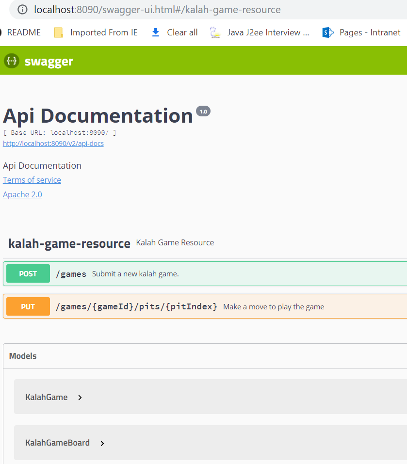
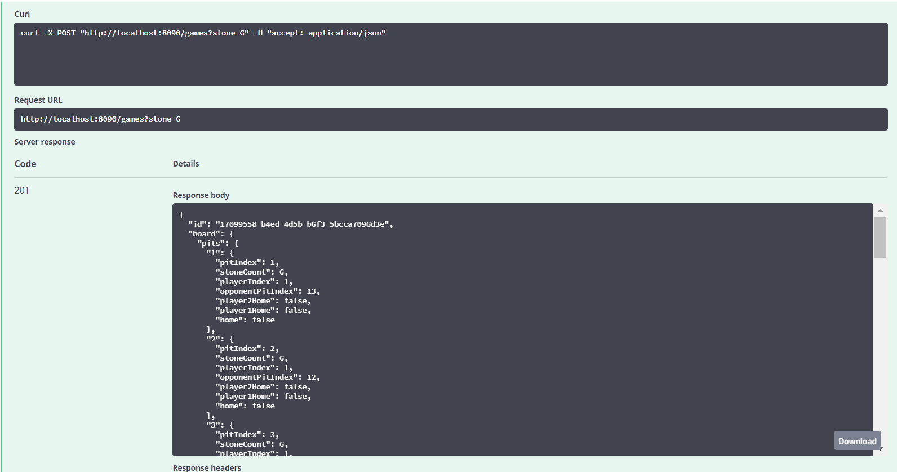
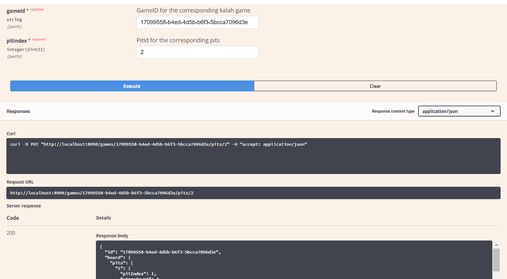

[](https://travis-ci.org/giova333/kalah-game)
[](https://codecov.io/gh/revathiieee/kalah-app)
[](https://www.codacy.com/app/revathiieee/kalah-app?utm_source=github.com&amp;utm_medium=referral&amp;utm_content=revathiieee/kalah-app&amp;utm_campaign=Badge_Grade)
# kalah-app
This is a java springboot application that runs the kalah game. The implementation of this app for 6 stones by default. Please find wikipedia to know general rules of this game.

### Summary of the kalah game

* Each of the two players has six pits in front of them.
* To the right of the six pits, each player has a larger pit, his Kalah or home.
* To start the game, six stones are put In each pit.
* The player who begins picks up all the stones in any of their own pits, and sows the stones on to the right, one in each of the following pits, including his own Kalah.
* No stones are put in the opponent's' Kalah. If the players last stone lands in his own Kalah, he gets another turn. This can be repeated any number of times before it's the other player's turn.
* Two players have to play on the same screen.

### Installation & Execution Steps

**Prerequisties**

   * Java8
   * Maven 3.5.4

**Dependencies used for this application**

  * Spring boot 2.1.2 - Spring Framework
  * Swagger API 2.9.2 - REST API Documentation
  * lombok 1.18.4 - Java Library
  * Jacoco Plugin 0.8.2 - Unit Test Coverage Plugin

### Execution ###

1. **Checkout the source code**

    ```
      git clone https://github.com/revathiieee/kalah-app
      cd kalah-app
    ```

2. **Build the application**
    
    ```
    mvn clean install 
    ```

3. **Run the application**
    ```
    mvn spring-boot:run
    ```
    
### REST API Docuumentation

   After running the application and browse the swagger api url
   
   http://localhost:8090/
   
### Tools Used

   * **Travis CI** - For continous integration
   * **codecov.io** - Highly integrated tools to group, merge, archive, and compare coverage reports.
   * **Codacy** - Automates code reviews and monitors code quality over time.

### Screenshots

**Homepage**


**creategame**


**playgame**


### Author
**Revathi Kulandhaivelu**

#### Happy Coding